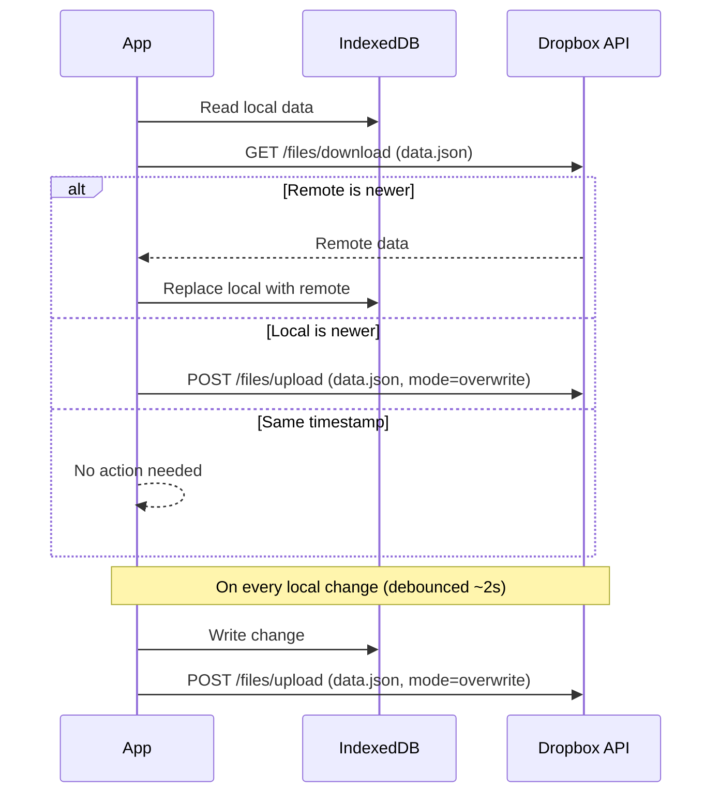

# Personal Task Manager PWA

## Implementation Todos

1. **scaffold** -- Scaffold the project: Vite + Solid.js + TypeScript, install dependencies (dexie, rrule, solid-dnd, dropbox SDK), configure PWA plugin, set up dark-mode-only CSS variables
2. **data-layer** -- Implement data layer: Dexie.js schema for Tasks, Generators, SyncMeta; CRUD operations; logical day utility (4am boundary)
3. **task-list-view** -- Build the main task list view: display today's tasks (including carried-over), mark complete, drag-to-reorder, open task detail panel for editing summary/description/labels
4. **postpone** -- Implement postpone: quick actions (tomorrow, next week) and date picker; hide postponed tasks from today's view; show them on target date
5. **generators** -- Build generator/scheduling system: generator CRUD UI, rrule configuration (human-friendly presets + advanced), task generation on app open with idempotent multi-day catch-up
6. **dropbox-sync** -- Implement Dropbox sync: OAuth PKCE flow, pull-on-open / push-on-change with debounce, last-write-wins conflict resolution, offline queue
7. **pwa** -- Finalize PWA: service worker caching strategy, install prompt, offline indicator, app manifest with icons

## Requirements Summary

### MVP

- **Single-list view** -- one flat, ordered list of today's tasks (like Trello with one board, one list)
- **Drag-to-reorder** tasks in the list
- **Task properties:** summary (required), description (optional, plain text), labels, associated date (default: today), sort order, completed flag
- **Task generators** (scheduled/recurring task creation) -- each generator has a recurrence rule and a list of task templates to create. E.g., a "Daily language practice" generator with an "every day" rule creates three tasks: "Duolingo", "Swedish podcast", "Anki flashcards"
- **Recurrence rules** supporting: every N days, specific weekdays, every Nth weekday, every last X of the month, etc. (RFC 5545 / iCal RRULE format covers all of these)
- **Day boundary at 4am** -- a new "day" starts at 04:00, not midnight
- **Task generation on app open** -- when the app is opened for the first time after 4am, generate all tasks due since last generation
- **Postpone tasks** -- to tomorrow, next week, or a specific date. Postponed tasks disappear from today's view and reappear on the target date
- **Auto carry-over** -- uncompleted tasks from previous days automatically appear in today's list
- **Offline-first** -- all features work without network; data stored locally in IndexedDB
- **Installable PWA** -- works on Linux, Windows, and Android via Chrome/Edge install
- **Dropbox sync** -- background sync via Dropbox API; pull on open, push on change (debounced); last-write-wins by timestamp
- **Dark mode only** -- no light theme

### Post-MVP (inform architecture but don't implement)

- Subtasks with cross-day scheduling (design TBD -- keep data model extensible with a nullable `parentTaskId`)
- Scheduled reminders / push notifications
- Geofencing notifications (will likely require Capacitor native wrapper)
- Voice command task creation (Web Speech API)
- Calendar view showing: postponed tasks, specifically-dated tasks, and projected future tasks from generators
- Filter by substring on summary or labels (both list and calendar views)
- Task history with limited retention (completed tasks kept for N days, then pruned)

## Proposed Tech Stack

- **Framework:** Solid.js + TypeScript -- JSX-based, fine-grained reactivity, small bundle (~7KB)
- **Build:** Vite + vite-plugin-pwa -- Fast dev, built-in PWA/Service Worker support via Workbox
- **Local storage:** Dexie.js (IndexedDB wrapper) -- Clean async API, good TypeScript support, versioned schemas, easy migrations
- **Recurrence:** rrule library -- RFC 5545 implementation, handles all periodicity patterns described
- **Drag & drop:** @thisbeyond/solid-dnd -- Solid-native DnD library
- **Sync:** Dropbox JavaScript SDK -- OAuth PKCE flow (no server needed), file read/write API
- **Styling:** CSS Modules or vanilla-extract -- Scoped styles, no runtime cost, dark-mode-only simplifies things
- **Testing:** Vitest -- Vite-native, fast

## Data Model (conceptual)

```typescript
interface Task {
  id: string;           // UUID
  summary: string;
  description: string;  // plain text, empty string if none
  labels: string[];
  date: string;         // ISO date (YYYY-MM-DD), the "logical day" (4am-based)
  sortOrder: number;
  completed: boolean;
  completedAt: number | null;  // timestamp
  createdAt: number;
  generatorId: string | null;  // which generator created this, if any
  parentTaskId: string | null; // for future subtask support
}

interface TaskTemplate {
  summary: string;
  description: string;
  labels: string[];
}

interface Generator {
  id: string;
  name: string;              // display name for the generator itself
  rrule: string;             // RFC 5545 RRULE string
  templates: TaskTemplate[]; // tasks to create on each occurrence
  active: boolean;
  lastGeneratedDate: string | null; // last logical day tasks were generated for
}

interface SyncMeta {
  lastSyncedAt: number;     // timestamp of last successful Dropbox sync
  lastModifiedAt: number;   // timestamp of last local change
}
```

## Sync Strategy



Since only one device is used at a time, conflicts are effectively avoided. The `lastModifiedAt` timestamp determines which copy wins.

## Project Structure

```
src/
  components/       -- UI components (TaskList, TaskCard, TaskDetail, GeneratorEditor, etc.)
  stores/           -- Solid.js reactive stores (tasks, generators, sync state)
  db/               -- Dexie.js database schema, migrations, queries
  sync/             -- Dropbox auth, push/pull logic
  scheduling/       -- Day boundary logic, task generation from rrules
  utils/            -- Date helpers (logical day calculation), ID generation
  styles/           -- Global styles, CSS variables for dark theme
  App.tsx
  index.tsx
  service-worker.ts -- Offline caching via Workbox
```

## Key Design Decisions

- **Logical day calculation:** A utility function `getLogicalDay(now: Date): string` returns the ISO date string, shifting anything before 4am to the previous day
- **Task generation is idempotent:** On app open, compare each generator's `lastGeneratedDate` with today's logical day; generate tasks for any missing days in between. This handles multi-day gaps (e.g., didn't open the app for 3 days)
- **Generators stored separately from tasks:** Keeps the generator config clean and the generated tasks independent (addressing the "not sure yet" on linking -- we store `generatorId` on the task for future traceability, but the task is fully independent once created)
- **Single JSON file for Dropbox sync:** For MVP, all data fits in one JSON file. If it grows too large post-MVP (unlikely for a personal app), can split into per-month files
- **Dexie.js for local storage:** Even though we sync a JSON blob, using IndexedDB (via Dexie) locally gives us indexed queries, which will matter for the calendar view and history features later
